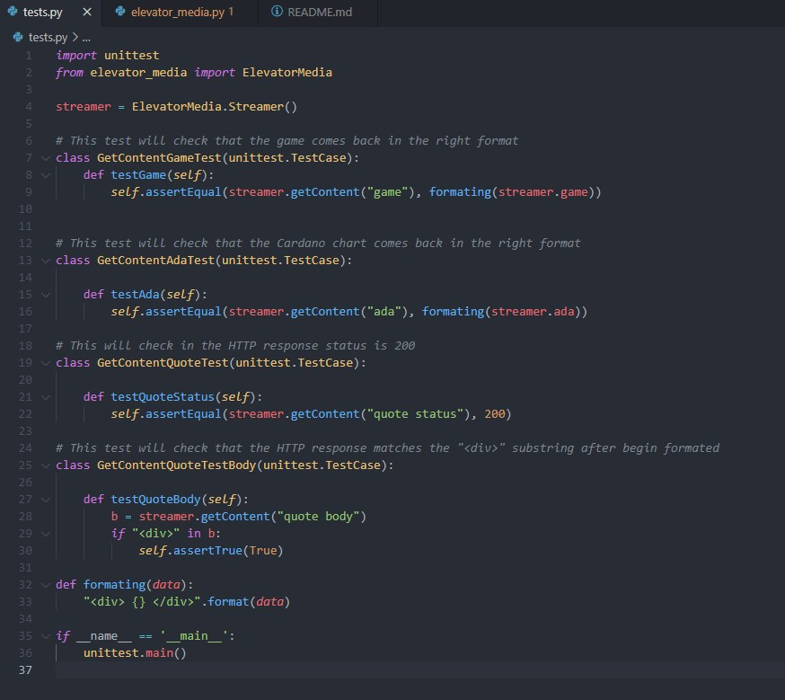
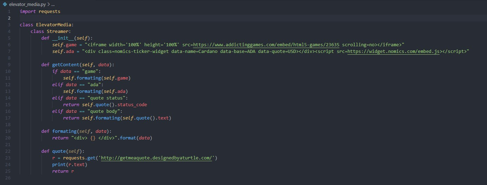
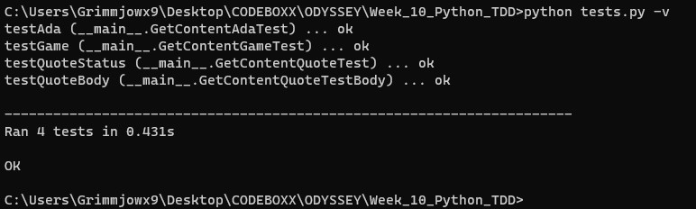

 
# TDD With Python

As a bonus, we had to practice TDD by implementing the ElevatorMedia logic in other languages.

Python, unlike Ruby and Elixir, doesn't have modules. We only use classes. I established an Outer class called ElevatorMedia, and an Inner class Streamer. This creates a nested class, a bit like nested modules in Elixir.

For testing purposes Python uses the unittest library.

**Here is the test file:**

**Here is the class:**

**All Tests pass**

